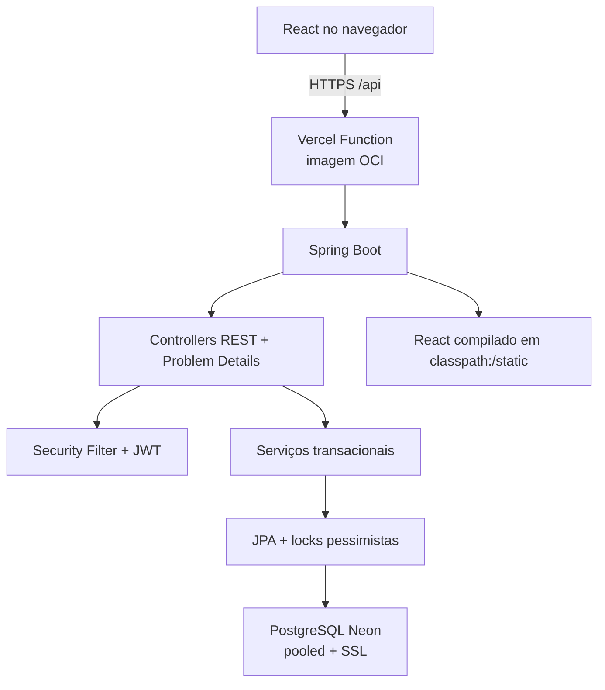
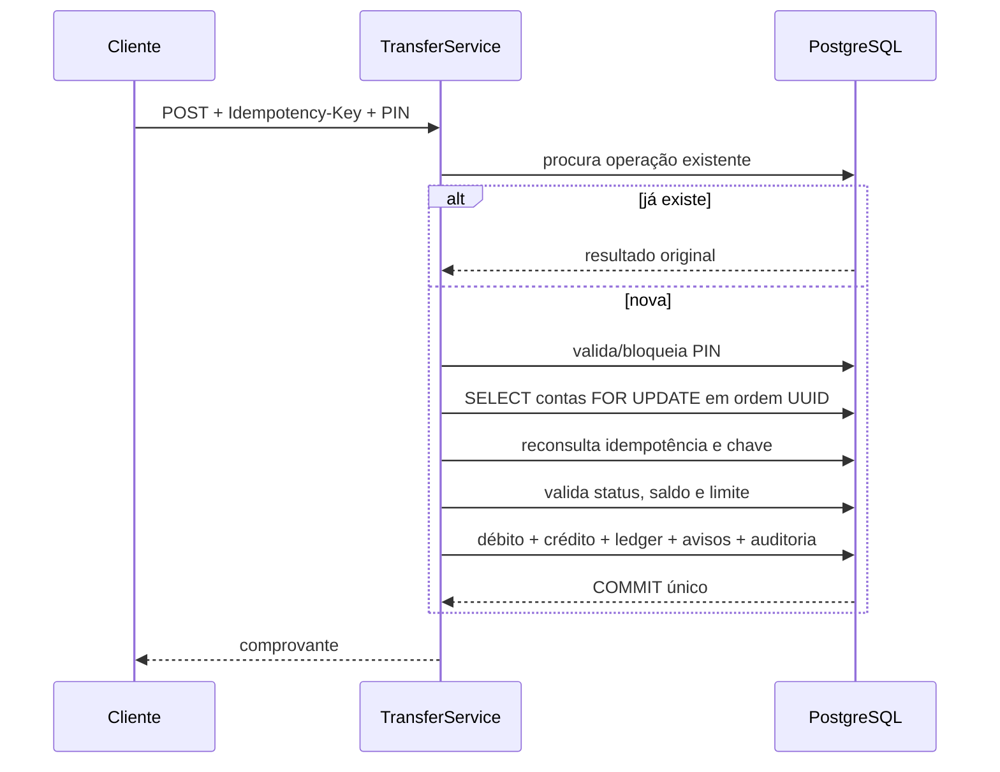

# Arquitetura do VBank Sandbox

## Visão geral

O mesmo domínio serve interface e API. Em desenvolvimento, Vite roda em `5173` e encaminha `/api` ao Spring em `8080`; somente essa origem recebe CORS. Em produção não há CORS porque tudo usa a mesma origem.

## Componentes

- `api`: controllers, DTOs validados, Problem Details e trace ID.
- `security`: filtro JWT e resolução do usuário atual.
- `service`: regras de autenticação, PIN, chave, transferência, funding, administração e PDF.
- `domain`: entidades JPA sem Lombok e valores monetários `BigDecimal`.
- `repository`: consultas paginadas e locks `PESSIMISTIC_WRITE`.
- `db/migration`: schema, constraints, índices e conta interna.
- `frontend`: contexto de sessão/status, cliente Axios, rotas lazy e páginas.

## Autenticação

1. Cadastro/login devolve JWT de acesso curto no JSON.
2. React mantém o access token somente em memória.
3. O refresh token aleatório vai para cookie HttpOnly `SameSite=Lax`; `Secure` é obrigatório em produção.
4. O banco guarda apenas SHA-256 do refresh token.
5. Refresh revoga o token anterior antes de emitir outro.
6. Alterar senha, bloquear conta ou “sair de todos” revoga sessões.
7. O filtro JWT recarrega status e papéis do usuário; conta bloqueada perde acesso mesmo com JWT ainda não expirado.

Senha e PIN usam BCrypt. PIN tem seis dígitos e controle persistido de cinco falhas/bloqueio. Nenhum segredo é incluído em resposta, auditoria ou log.

## Ledger e saldo inicial

A migration cria uma conta `SYSTEM` inacessível por login e sem chave. Ela tem reserva estritamente fictícia. Cadastro, recarga e ajuste movimentam essa conta e a conta do usuário, sempre com dois lançamentos. Uma transferência normal também cria débito e crédito.

O saldo é uma projeção materializada no registro `account`; o ledger é a trilha imutável da alteração. Ambos são atualizados no mesmo `@Transactional`.

## Transferência e concorrência

- A unicidade `(source_account_id, idempotency_key)` é garantida no banco.
- Contas são bloqueadas em ordem natural de UUID para reduzir deadlock.
- Não existe `synchronized`, cache de saldo ou lock local.
- Validações relevantes são repetidas depois dos locks.
- Qualquer exceção reverte saldo, transferência, ledger e notificações.
- Rate limits vivem em `rate_limit_bucket`, não exclusivamente na memória da instância.

## Estados efêmeros

Access token, estado de formulário, loaders e cache de tela são efêmeros. O contêiner não armazena arquivo permanente. O PDF nasce em memória e é devolvido na resposta. O PostgreSQL contém todo estado persistente.

## Docker e Vercel

`Dockerfile.vercel` tem três estágios: Node compila/testa React; Maven compila Spring com React incorporado; JRE 21 executa como não-root. A Vercel detecta esse arquivo na raiz e trata a imagem como Function stateless, com escala automática e `$PORT`.

## Decisões de custo

- um projeto Vercel, sem servidor separado;
- Neon pooled e Hikari `maximumPoolSize=3`, `minimumIdle=0`;
- sem Redis, armazenamento de arquivos, e-mail, SMS ou observabilidade paga;
- paginação e bundles por rota;
- CI público em `ubuntu-latest`, sem artefatos ou publicação de imagem.

