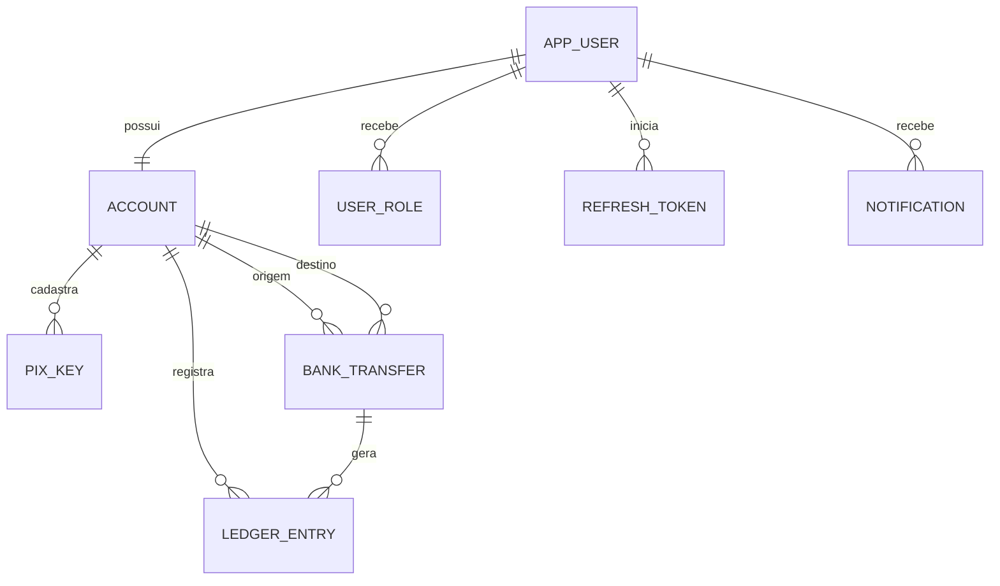

# Banco de dados

## PostgreSQL e migrations

Flyway é o único responsável pelo schema. Hibernate usa `ddl-auto=validate`; nunca `create` ou `update`. Um banco vazio é inicializado automaticamente por `V1__initial_schema.sql`.

Não altere uma migration que já tenha sido aplicada. Mudanças futuras devem criar `V2__descricao.sql`, `V3__descricao.sql` e assim por diante.

## Tabelas

| Tabela | Responsabilidade |
|---|---|
| `app_user` / `user_role` | identidade, papéis, senha, PIN e bloqueio |
| `account` | conta, saldo materializado, limite e versão |
| `pix_key` | chave interna normalizada; unicidade parcial de ativas |
| `bank_transfer` | operação, IDs públicos, estado e idempotência |
| `ledger_entry` | débito/crédito e saldo resultante |
| `refresh_token` | hash, expiração, revogação e dispositivo |
| `audit_log` | eventos de segurança/financeiros sem segredos |
| `notification` | avisos somente dentro da aplicação |
| `rate_limit_bucket` | limite persistido por janela |



## Dinheiro fictício

Java usa `BigDecimal`; PostgreSQL usa `NUMERIC(19,2)`. Checks rejeitam saldo negativo e valor de transferência não positivo. Nunca use `double`/`float`.

Toda mudança de saldo cria ledger. Cadastro e funding debitam a conta interna e creditam a conta de demonstração. Ajuste negativo faz o inverso. A conta interna não aparece em resolução de chave e não autentica.

## Índices e constraints

- e-mail e username globais únicos;
- chave normalizada única quando `ACTIVE`;
- índice de chaves por conta/status;
- idempotência única por conta de origem;
- extrato por conta/data;
- transferências por origem/destino/data e status;
- auditoria e notificações por data/usuário;
- checks de enum e valores no banco.

## Neon

Use o endpoint pooled (`-pooler`) com `sslmode=require`. O PgBouncer do Neon opera em transaction pooling, adequado às transações curtas do projeto. O Hikari é deliberadamente pequeno:

```text
DB_POOL_SIZE=3
DB_MINIMUM_IDLE=0
```

Não dependa de IP fixo. Imagens de contêiner Vercel não oferecem Static IP; Neon aceita a conexão TLS pública autenticada.

## Backup manual

O plano e as ferramentas do Neon podem mudar. Confira a janela de restauração disponível. Para uma cópia lógica manual, use uma máquina com `pg_dump`:

```bash
pg_dump --format=custom --no-owner --no-acl \
  "postgresql://USUARIO@HOST/DB?sslmode=require" > vbank-backup.dump
```

O comando pede senha quando necessário. Não envie o dump ao Git; ele contém dados da aplicação. Guarde-o criptografado e teste restauração em um banco separado.

