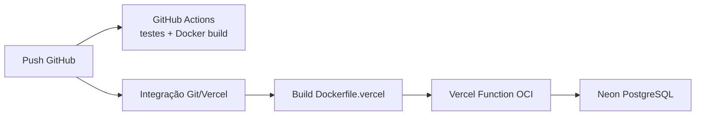

# Deploy sem Docker local

## Sequência

## GitHub

Crie repositório público vazio, confira `git status`, commite e envie `main`. O CI não faz deploy, não precisa de segredos e não publica imagem. Ele usa Docker já presente no runner padrão para Testcontainers e build local da imagem.

## Neon

Crie projeto Free e conexão pooled. Converta a URI PostgreSQL para JDBC e mantenha usuário/senha separados. Teste localmente antes do deploy. Flyway executa na inicialização; o usuário precisa criar/alterar tabelas no schema.

Também é possível provisionar Neon via Vercel Marketplace depois de vincular/importar o projeto. Confirme plano Free e adapte os nomes das variáveis fornecidas. Não deixe preview usar o banco Production.

## Vercel

1. Importe o repositório GitHub no Hobby.
2. Root Directory: raiz.
3. Cadastre variáveis Production.
4. Confirme que `Dockerfile.vercel` foi detectado.
5. Faça deploy e acompanhe build/runtime logs.
6. Verifique `/api/health` e a landing.
7. Rode smoke test contra a URL, se desejar: `./scripts/smoke-test.sh https://PROJETO.vercel.app`.

Não cadastre `PORT`; a Vercel injeta esse valor. Não use volume: instâncias são stateless e podem escalar a zero.

## Variáveis

Consulte `.env.example` e README. Segredos devem ter escopo **Production**. Previews devem ter banco separado ou não receber as variáveis.

## Administrador inicial

Defina `ADMIN_BOOTSTRAP_ENABLED=true` e os seis campos de admin para um deploy. O bootstrap é idempotente e não troca senha de usuário existente. Depois de confirmar login, altere para `false` e redeploy. A senha não aparece em logs.

## Logs

Use o painel Vercel para build/runtime. A aplicação registra eventos operacionais, mas auditoria funcional fica no PostgreSQL. Nunca habilite SQL com parâmetros sensíveis nem imprima o ambiente.

## Rollback

- Código: selecione deployment anterior e use rollback/promote na Vercel.
- Banco: prefira migrations aditivas e compatibilidade entre versão anterior/nova.
- Migration destrutiva: não é revertida automaticamente por rollback de código; restaure backup ou escreva migration corretiva.

## Atualização segura

1. Crie migration aditiva.
2. Rode unitários, frontend e integração.
3. Abra PR e confira preview sem banco Production.
4. Faça merge; CI e Vercel constroem.
5. Observe health/logs e execute smoke.
6. Remova campo antigo somente em versão posterior.

## Sem Docker local

Editar, testar unidades, usar Neon, fazer push e importar na Vercel não exige Docker. O GitHub Actions é a validação remota da imagem. Docker local é somente conveniência para contribuidores.

